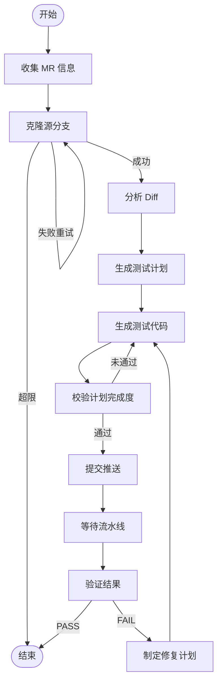
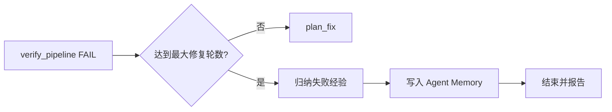

# UT Agent — 自动化单元测试生成 Agent

## 项目简介

`ut_agent` 是一个基于 **LangGraph** 状态机的自动化单元测试生成系统。它监听 GitLab Merge Request，自动完成从代码变更分析到测试生成、CI 验证、失败修复的完整闭环，最终将通过 CI 的测试代码提交到 MR 源分支。

## 设计目标

- **全自动闭环**：无需人工干预，从 MR 触发到 CI 通过一气呵成
- **高覆盖率**：目标增量行覆盖率 ≥ 80%，P0 用例 100% 覆盖
- **自动修复**：CI 失败后自动诊断、生成修复计划并重试（最多 5 轮）
- **Token 高效**：分批分析、分片计划、日志智能裁剪，避免 token 爆炸

## 架构概览



## 目录结构

```
ut_agent/
├── __init__.py            # 导出 UTAgent 类
├── agent.py               # 核心状态机（节点函数、路由逻辑、图构建）
├── state.py               # UTAgentState 类型定义
├── config.py              # 从 settings.toml 加载配置
├── llm.py                 # LLM 调用封装（支持自动续写）
├── settings.toml          # 模型/Agent 配置
├── prompt/                # Prompt 模板
│   ├── analyze_diff_system.md
│   ├── analyze_diff_user.md
│   ├── generate_test_plan_system.md
│   ├── generate_test_plan_user.md
│   ├── generate_patch_system.md
│   ├── generate_patch_user.md
│   ├── generate_patch_cpp.md
│   ├── generate_patch_python.md
│   └── validate_plan_system.md
├── tools/                 # 工具层
│   ├── context.py         # ToolContext（git_provider/output_dir）
│   ├── clone_branch.py    # 浅克隆 MR 源分支
│   ├── commit_push.py     # git add/commit/push
│   ├── fetch_pipeline.py  # 轮询流水线状态、提取日志
│   ├── fetch_dependency.py# 获取依赖文件（头文件等）
│   ├── parse_diff.py      # 解析 unified diff
│   ├── save_source.py     # 变更文件落盘
│   └── tool_registry.py   # LangGraph @tool 注册
├── test/                  # 测试与诊断脚本
│   ├── test_parse_diff.py
│   └── diag_pipeline.py
└── workspace/             # 运行时工作空间（自动创建）
```

## 工作流节点详解

### 1. collect_mr_info — 收集 MR 信息

记录 MR 标题、作者、源/目标分支、diff 文件列表等元数据。

### 2. clone_repo — 克隆源分支

执行 `git clone --depth 1 --branch <source_branch>`，最多重试 3 次。

### 3. analyze_diff — 分析变更

- 过滤已删除文件，仅关注新增/修改的代码
- ≤ 5 文件单次 LLM 调用；> 5 文件按批次（每批 5 个）分析
- 输出结构化 JSON：可测试单元、分支路径、外部依赖、优先级
- 分析结果发布为 MR 评论

### 4. generate_test_plan — 生成测试计划

- 读取 diff 分析结果 + 项目上下文（CMakeLists.txt、package.xml 等）
- 调用 LLM 生成大型 JSON 测试计划（支持自动续写，最多 3 次，32k tokens/次）
- 自动修复截断 JSON，按 5 个 suite 分片落盘

### 5. generate_patch — 生成测试代码

- 调用 **Copilot CLI**（`copilot -p <prompt> --allow-all-tools`）生成代码
- 支持三种模式：
  - 首次生成（按分片执行）
  - 补充生成（处理 pending_cases）
  - 修复生成（按 fix_plan 修复 CI 问题）
- 安全网：检测 CMakeLists.txt 异常修改时自动回滚重试
- 通过文件 mtime 快照检测新增/修改的文件

### 6. validate_plan — 校验计划完成度

- 扫描生成文件，提取测试函数名（GTest `TEST_F`/`TEST`、pytest `def test_`）
- 与计划中的用例名比对，计算完成率
- 通过条件：全部完成，或达到 80% 且 P0 全覆盖
- 未通过时回到 generate_patch 补充（最多 3 轮）

### 7. upload_to_gitlab — 提交推送

执行 `git add / commit / push`，提取 commit SHA 用于后续流水线追踪。

### 8. check_pipeline — 等待流水线

- 初始等待 60s，之后每 30s 轮询一次，最长等待 20 分钟
- 递归展开父子 pipeline（bridges → downstream）
- 关注目标 job：`build_release_arm64`、`x86_64_ut_coverage_check`
- 智能日志提取：正则匹配错误行 ± 上下文 + 尾部总结，上限 500 行

### 9. verify_pipeline — 验证结果

结构化判定 PASS/FAIL，失败分类：

| 类型 | 含义 |
|------|------|
| `build_failure` | 编译失败 |
| `test_failure` | 测试用例失败 |
| `coverage_insufficient` | 覆盖率不达标 |
| `pipeline_timeout` | 流水线超时 |
| `unknown` | 未知错误 |

### 10. plan_fix — 制定修复计划

根据 failure_type 和错误日志，LLM 生成针对性修复指令 JSON，驱动下一轮 generate_patch。

## 迭代循环机制

### 计划完善循环（generate_patch ↔ validate_plan）

```
generate_patch → validate_plan → pending_cases 不为空 → generate_patch（补充）→ ...
```

最多 3 轮（`MAX_PATCH_ITERATIONS = 3`），或 80%+ 完成率且 P0 全覆盖即放行。

### CI 修复循环（verify → fix → patch → upload → check → verify）

```
verify_pipeline(FAIL) → plan_fix → generate_patch(修复模式) → upload → check → verify → ...
```

最多 5 轮（`MAX_FIX_ITERATIONS = 5`）。

## 配置说明

`settings.toml` 配置项：

```toml
[llm]
model = "anthropic/claude-sonnet-4-5-20250929"  # LLM 模型
api_key = "sk-..."                               # API Key
base_url = "https://..."                         # API 端点
temperature = 0.2                                # 生成温度

[agent]
test_mode = false  # true 时跳过 LLM，生成 dummy 文件测试推送链路
```

关键硬编码常量（`agent.py`）：

| 常量 | 值 | 说明 |
|------|----|------|
| `MAX_CLONE_ATTEMPTS` | 3 | 克隆最大重试次数 |
| `MAX_PATCH_ITERATIONS` | 3 | Patch 生成最大迭代数 |
| `MAX_FIX_ITERATIONS` | 5 | CI 修复最大迭代数 |
| `BATCH_SIZE` | 5 | Diff 分析分批大小 |
| `MIN_COVERAGE_THRESHOLD` | 80% | 计划完成度最低阈值 |
| `COPILOT_TIMEOUT` | 600s | Copilot CLI 超时时间 |

## 运行时 Workspace

每次运行在 `ut_agent/workspace/` 下生成结构化输出：

```
workspace/
├── logs/ut_agent.log
└── mr_{id}/
    ├── repo/                    # 克隆的仓库
    ├── analysis/                # Diff 分析结果
    ├── changed_files/           # 变更文件全量源码
    ├── deps/                    # 依赖文件（头文件等）
    ├── test_plan.json           # 测试计划
    ├── plan_parts/              # 计划分片
    ├── generated_patches.json   # 生成的 patch 文件清单
    ├── validation_iter_N.json   # 各轮校验结果
    ├── pipeline_feedback.json   # 流水线反馈
    └── fix_plan_iterN.json      # 修复计划
```

## 自学习机制（Agent Memory）

当修复循环最终失败（达到 `MAX_FIX_ITERATIONS` 仍未通过 CI）时，Agent 会将本次失败的完整上下文写入 **Agent Memory**，形成经验库供后续任务参考。

### 记录内容

每条失败记录包含：

| 字段 | 说明 |
|------|------|
| `failure_type` | 失败分类（build_failure / test_failure / coverage_insufficient） |
| `error_signature` | 错误特征摘要（去噪后的关键错误信息） |
| `diff_context` | 触发失败的代码变更类型与模式 |
| `fix_attempts` | 各轮修复计划及其结果 |
| `root_cause` | LLM 归纳的根因分析 |
| `lesson_learned` | 总结的经验教训（什么修复策略有效/无效） |

### 工作流程



### 学习应用

在后续 MR 的以下阶段，Agent 会检索 Memory 中的相关经验：

1. **generate_test_plan** — 规避已知会导致编译失败的测试模式
2. **generate_patch** — 避免重复使用已证明无效的代码生成策略
3. **plan_fix** — 优先采用历史上成功的修复方案，跳过已失败的修复路径

### 存储位置

经验记录持久化在 `ut_agent/workspace/memory/` 目录下，按失败类型分类：

```
workspace/memory/
├── build_failures.jsonl      # 编译失败经验
├── test_failures.jsonl       # 测试失败经验
└── coverage_failures.jsonl   # 覆盖率不足经验
```

每条记录为一行 JSON，支持增量追加和按相似度检索。

## 集成关系

- **GitLab**：通过 pr-agent 的 `GitLabProvider` 实现 MR 评论、文件获取、Pipeline/Job 查询
- **LLM**：通过 litellm 调用（支持 OpenAI/Anthropic 兼容接口），用于 diff 分析、计划生成、验证判定、修复规划
- **Copilot CLI**：实际测试代码生成由本地 Copilot CLI 执行，Agent 负责组织 prompt 和校验结果
- **CI/CD**：被动监控 GitLab CI 流水线，提取目标 job 日志用于诊断
